A robust AutoInventory plugin for PocketMine-MP, designed for high performance and absolute stability. Features include direct-to-inventory drops, full inventory detection, configurable messages, and fine-grained permission control. Its core design prevents item duplication bugs by using fail-safe logic: ground drops are cancelled before items are added to the inventory, guaranteeing that items can never be duplicated, even during server lag or crashes.


# 🤖 API-Specific AI Models
### *Specialized AI for Specialized Code*

<div align="center">


**🚀 Building the future of framework-specific code generation**

[Join Waitlist](#-join-our-community) • [Documentation](#-documentation) • [Roadmap](#-roadmap)

</div>

---

## 🎯 **The Vision**

We're developing **API-specific AI models** trained to excel at particular frameworks and libraries. Our first model focuses on **PocketMine plugin development**.

## 🔍 **The Problem We're Solving**

While general-purpose AI models like GPT, Gemini, and Claude are capable, they face limitations when working with specialized APIs:

```diff
- Training data often lags behind the latest API versions
- Lack deep, specialized knowledge of framework patterns
- General training = not optimized for specific ecosystems
+ Our solution: Framework-focused training for better results
```

## ⚡ **Our Approach**

<table>
<tr>
<td width="50%">

### 🎯 **Specialized Training**
- Deep understanding of API conventions
- Framework-specific patterns & optimizations
- Current best practices integration

</td>
<td width="50%">

### 🚀 **Better Results**
- Accurate code generation
- Reduced API hallucinations
- Context-aware implementations

</td>
</tr>
</table>

## 🛠️ **Current Focus: PocketMine**

<div align="center">

### 🎮 Minecraft Bedrock Server Development

*From basic plugins to complex server modifications*

</div>

## 🗺️ **Roadmap**

```mermaid
graph LR
    A[🎯 PocketMine] --> B[🐍 Discord.py]
    B --> C[🟨 Discord.js]
    C --> D[☕ Minecraft Java]
    D --> E[🌐 More APIs...]
    
    style A fill:#e1f5fe
    style B fill:#f3e5f5
    style C fill:#fff3e0
    style D fill:#e8f5e8
    style E fill:#fce4ec
```



### 📅 **Phase 1** - *Current*
- [x] PocketMine model training
- [ ] Beta testing & refinement
- [ ] Community feedback integration

### 📅 **Phase 2** - *Q3 2025*
- [ ] Discord.py specialized model
- [ ] Discord.js specialized model
- [ ] Enhanced PocketMine capabilities

### 📅 **Phase 3** - *Q4 2025*
- [ ] Minecraft Java (Bukkit/Spigot/Paper)
- [ ] Local deployment options
- [ ] Community-requested APIs

## 💡 **Why Specialized Models?**

<div align="center">

| 🌐 **General Models** | 🎯 **Our Specialized Models** |
|:---:|:---:|
| Jack of all trades | Master of specific APIs |
| Generic patterns | Framework-optimized code |
| Occasional outdated info | Current best practices |
| Broad but shallow | Deep domain expertise |

</div>

## 🚀 **Features**

- ✅ **API-Accurate**: Trained on latest framework versions
- ✅ **Best Practices**: Follows established coding conventions
- ✅ **Context-Aware**: Understands framework-specific patterns
- ✅ **Free**: Local deployment options planned
- ✅ **Community-Driven**: Built with developer feedback

## 📚 **Documentation**

Coming soon! We're preparing comprehensive docs covering:

- 📖 Model usage guides
- 🛠️ Integration examples  
- 🎯 Best practices
- 🔧 Local deployment


## 🌟 **Join Our Community**

<div align="center">

### 🎉 **Be part of the revolution!**

[](https://discord.gg/pocketkimi)

*Get early access • Share feedback • Shape the future*

</div>

---

<div align="center">

### 🔮 **The Future of Code Generation**

*Specialized AI models that understand your frameworks as well as you do*

**Made with ❤️ by developers, for developers**

⭐ **Star this repo** if you're excited about framework-specific AI!

</div>

---

<sub>📝 **Note**: This project is in active development. Join our Discord for the latest updates!</sub>
